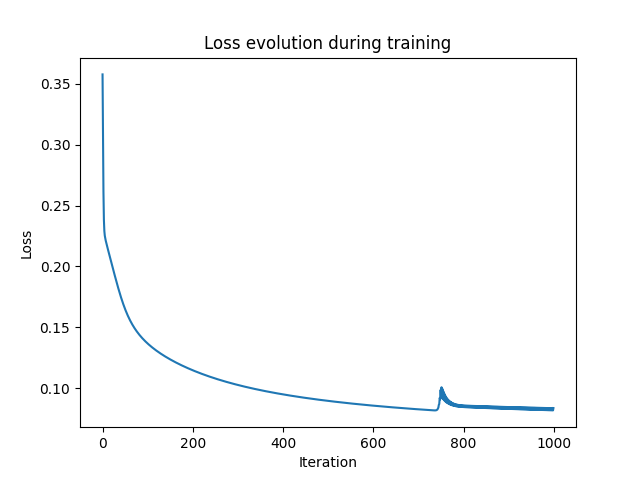

# Simple Neural Network for Flower Detection

This project implements a simple neural network to classify flowers as either red or blue based on their features. 
The neural network is built from scratch using `NumPy` and I used `Matplotlib` to visualize the loss evolution during the training process.

## Loss Evolution


## Dataset

The dataset consists of flower features represented by two attributes:
- Petal length
- Petal width

The target variable is:
- 1 for red flowers
- 0 for blue flowers

## Requirements

- Python 3.x
- NumPy
- Matplotlib

## Setup

1. **Clone the repository:**

```bash
git clone git@github.com:iamhmh/neural_network_flower.git
cd neural_network_flower
```

2. **Install dependencies:**
```bash
pip install -r requirements.txt
```

## Usage

1. **Run the script:**

```bash
python neural_network_flower.py
```

## Data Preparation

The data is normalized and split into training and testing sets.

## Neural Network Structure

The neural network has:
- 2 input neurons
- 3 hidden neurons
- 1 output neuron

## Training

The network is trained using forward and backward propagation. The sigmoid function is used as the activation function.

## Prediction

After training, the network predicts the class of a flower based on its features.

## Output

The script will print the training progress and the final prediction for the test data.

## Author

- **HICHEM GOUIA** - (https://github.com/iamhmh)
